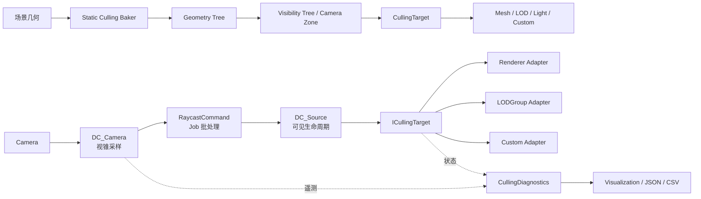

# Advanced Culling System

面向大型 Unity 场景的可见性优化框架。项目实现了运行时动态遮挡裁剪和离线静态可见集烘焙，并配套编辑器工作流、运行时诊断、数据导出和可复现 A/B 基准。

## 项目亮点

- **双裁剪后端**：动态模式使用 `RaycastCommand + Job System` 处理运行时遮挡；静态模式使用 Geometry Tree、Camera Zone 和 Visibility Tree 烘焙可见集。
- **目标抽象**：动态后端把 Renderer、LODGroup 和自定义逻辑收敛到 `ICullingTarget`；静态后端通过 `CullingTarget` 抽象扩展 MeshRenderer、LODGroup、Light 和自定义回调。
- **空间组织与生命周期**：Source Provider 可选择单目标或空间树组织；命中只刷新 Source 生命周期，避免单帧采样缺失造成高频闪烁。
- **编辑器工具链**：包含 Controller、Camera、Source、Camera Zone、Chunk 的 Inspector、选择器、烘焙和配置验证工具。
- **可观测性**：诊断模块旁路采集 300 帧帧时、P95、CPU/GPU、真实裁剪率和 Rendering Statistics，可导出 JSON/CSV。
- **可复现验证**：使用内容完全一致的场景分别运行 ACS Off/On，原始结果随仓库保存，不只展示效果截图。

## 架构



核心设计是把“如何判断可见”与“目标如何响应”分离。动态后端通过 `ICullingTarget` 驱动目标，静态后端通过 `CullingTarget` 层次驱动目标；两条后端都将 Renderer、LODGroup、Light 或业务回调封装在 Adapter 内，使空间查询与具体显隐行为保持独立。

运行时和编辑器代码严格分离在 `Core/Runtime` 与 `Core/Editor`。射线方向和 `NativeArray` 持久化复用，批量调度 Physics Job；诊断历史使用固定长度环形缓冲区，目标数量采用增量统计，不参与实际裁剪决策。

## 性能实测

项目提供一组内容逐字节相同的 A/B 场景：

- `Scene.unity`：Unity 默认视锥裁剪，ACS 关闭；
- `Scene 1.unity`：相同几何，在加载后自动启用 ACS Dynamic，`1500 rays/frame + FullDisable`。

2026-08-26 在 Unity `2022.3.62f3c1` Editor Play Mode、Game View 静止相机下，预热后采集最近 300 帧。测试机为 Windows 11、Intel Core Ultra 7 265、RTX 5060、64 GB RAM。

| 指标 | ACS 关闭 | ACS Dynamic | 变化 |
| --- | ---: | ---: | ---: |
| 平均帧时 | 11.01 ms | 2.58 ms | -76.5% |
| P95 帧时 | 12.44 ms | 3.14 ms | -74.7% |
| CPU Frame Timing | 11.01 ms | 2.58 ms | -76.5% |
| GPU Frame Timing | 5.99 ms | 0.26 ms | -95.6% |
| Batches | 6,291 | 297 | -95.3% |
| SetPass | 59 | 50 | -15.3% |
| Triangles | 78,268 | 6,340 | -91.9% |
| Vertices | 156,542 | 12,686 | -91.9% |
| 射线批次墙钟耗时 | 0 | 0.341 ms | +0.341 ms |
| 目标（可见 / 总数） | 未注册 | 106 / 24,960 | 裁剪 24,854（99.58%） |

原始机器可读结果见 [`docs/benchmarks/dynamic-base-2026-08-26.json`](docs/benchmarks/dynamic-base-2026-08-26.json)。结果表明，在该高遮挡静止视角中，减少渲染工作量的收益明显高于射线成本。该数据是单轮 Editor 参考值，不代表跨机器、移动相机或 Player Build 的通用结论。

## 环境要求

- Unity `2022.3.62f3c1`
- Windows（项目当前使用的开发环境）

首次用 Unity Hub 打开项目后，等待 Package Manager 和 Asset Database 完成导入即可。

## 目录结构

```text
Assets/AdvancedCullingSystem/
├── Core/Runtime      # 运行时裁剪逻辑
├── Core/Editor       # Unity 编辑器扩展和烘焙工具
└── Tutorials         # 教程脚本、材质和示例场景
```

## 教程场景

示例场景位于 `Assets/AdvancedCullingSystem/Tutorials/Scenes/`：

1. DynamicCulling Base
2. DynamicCulling Instanced Objects
3. DynamicCulling Custom Targets
4. StaticCulling Base
5. StaticCulling Custom Targets
6. StaticCulling Transparency

## 使用建议

动态裁剪适合对象和相机持续变化的场景；静态裁剪适合布局稳定、可以接受预烘焙时间的场景。正式项目中建议先在教程场景中验证裁剪边界、阴影和透明材质行为，再接入生产场景。

## 可视化调试

打开 Unity 菜单 `Tools/NGSTools/Advanced Culling System/Visualization`。进入 Play Mode 后，窗口会同时显示：

- 最近 300 帧的平均帧时与 P95、CPU/GPU Frame Timing；
- 射线数、命中率和射线批次墙钟耗时；
- 已注册目标、可见目标、已裁剪目标、真实裁剪率和状态切换数；
- Batches、SetPass、Triangles、Vertices；
- 命中率（绿色）、裁剪率（蓝色）、帧时（橙色）时间线。

窗口支持将摘要导出为 JSON、将逐帧历史导出为 CSV。编辑器菜单 `Tools/NGSTools/Advanced Culling System/Log Current Diagnostics` 会输出带 `[ACS-DIAGNOSTICS]` 前缀的机器可读 JSON，适合 Unity MCP、CI 或外部脚本采集。未进入 Play Mode 时窗口明确显示“未采样”，不会再把缺失数据画成 0。

需要特别注意：射线命中率不等于裁剪率。命中率描述采样射线碰到 Collider 的比例；裁剪率描述 ACS 实际隐藏的目标比例。判断收益应优先看裁剪率、帧时和 Rendering Statistics。

## 与 Unity 原生裁剪的区别

| 维度 | Unity 原生 Occlusion Culling | Advanced Culling System |
| --- | --- | --- |
| 核心算法 | 编辑器烘焙 cell/PVS，运行时由 Camera 查询 | 动态 Physics 射线采样；静态 Geometry/Visibility Tree 烘焙 |
| 动态对象作遮挡物 | 不支持；动态对象只能作为被遮挡物 | Collider 和 Layer 正确时可参与动态遮挡 |
| 控制目标 | 主要是 Renderer 绘制 | Renderer、LODGroup、Light、自定义回调，可保留阴影 |
| 运行成本 | 查询烘焙数据，额外内存；不需要每帧 Physics 射线 | 动态模式每帧产生射线并可能在 `LateUpdate` 等待 Job |
| 正确性特征 | 成熟、保守、引擎级多相机集成 | 有限采样可能漏掉小目标或快速运动，需要生命周期和误剔除测试 |
| 当前可视化 | cell、portal、visibility line | 裁剪率/命中率/帧时/渲染统计；静态树解释仍较弱 |

因此本项目不是对 Unity 原生方案的简单封装或替换，而是补充运行时动态遮挡、自定义逻辑目标和可组合静态可见集。选择哪条后端取决于场景是否稳定、遮挡物是否动态以及目标是否局限于 Renderer。

点击 `Run validation` 可以检查静态裁剪相机和 Camera Zone 是否缺少可见性树或尚未完成烘焙。提交场景前建议运行一次，并结合 Unity Profiler、Frame Debugger 和 Rendering Statistics 验证实际收益。

## Git 忽略内容

Unity 的 `Library/`、`Logs/`、`obj/` 和 `UserSettings/` 等生成目录不纳入版本控制。
